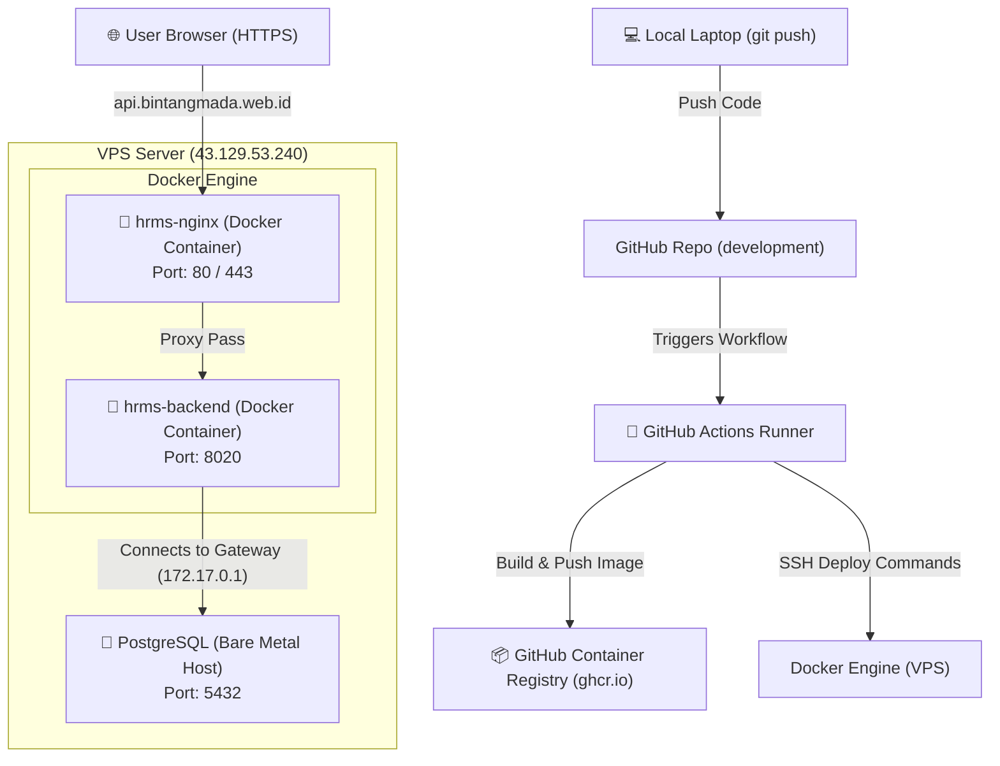

# HRMS Project Infrastructure & CI/CD Documentation

This document describes the deployment architecture, configuration details, and commands used to run and automate the HRMS application on your VPS.

---

## 1. System Architecture Overview

The HRMS infrastructure uses a **hybrid architecture** (mix of bare-metal database and dockerized services) to achieve high performance, maximum security, and low memory consumption on the VPS.



---

## 2. Component Configuration Details

### 🐘 Database (PostgreSQL - Bare Metal on VPS)
*   **Why Bare Metal?** Running PostgreSQL directly on the host OS saves RAM and CPU overhead compared to running it in Docker.
*   **Port:** `5432`
*   **Access Scope:** The database is **blocked from the public internet** by the firewall. It only listens on:
    *   `localhost` (`127.0.0.1`) for local command-line access.
    *   `172.17.0.1` (The Docker bridge network gateway) so that the dockerized backend can connect to it.
*   **Backend Connection config:**
    *   `DB_HOST`: `172.17.0.1`
    *   `DB_PORT`: `5432`

---

### 🐳 Web Server (Nginx & Certbot - Dockerized)
You might remember editing files on the VPS filesystem, which is correct! However, the Nginx process itself runs inside a Docker container.
*   **Nginx Container Name:** `hrms-nginx` (runs `nginx:alpine`)
*   **How it works:**
    *   Nginx binds to host ports **`80`** (HTTP) and **`443`** (HTTPS) to handle public internet traffic.
    *   **Configuration Files:** Stored on the host OS filesystem at `/home/ubuntu/webserver/nginx/conf.d/` and mounted directly into the Nginx container at `/etc/nginx/conf.d/`.
    *   **SSL Certificates:** Generated by a `certbot` container on the host at `/home/ubuntu/webserver/certbot/conf` and mounted into the Nginx container at `/etc/letsencrypt`.
*   **Routing:** Nginx maps `https://api.bintangmada.web.id` to the backend container at `http://localhost:8020`.

---

### 🚀 CI/CD Pipeline (GitHub Actions)
*   **Configuration File:** `.github/workflows/deploy.yml`
*   **Trigger:** Automated push to the `development` branch.
*   **Workflow Steps:**
    1.  **Checkout:** Pulls the latest code.
    2.  **Buildx:** Sets up Docker build cache to make builds extremely fast.
    3.  **Build & Push:** Compiles the Spring Boot project inside a Docker container (`Dockerfile`) and pushes the image `ghcr.io/bintangmada/hrms-backend:latest` to GHCR.
    4.  **Copy Configuration:** Copies `docker-compose.yml` to the VPS `~/hrms/` directory.
    5.  **SSH Deploy:** Logs into GHCR on the VPS and runs:
        ```bash
        sudo docker compose pull backend
        sudo docker compose up -d backend
        sudo docker image prune -f
        ```

---

## 3. Handy Infrastructure Cheat Sheet

Here are the terminal commands you can use on the VPS to inspect and control the infrastructure components:

### 📱 Managing Application Containers
*   **View Running Containers:**
    ```bash
    sudo docker ps
    ```
*   **View Spring Boot Backend Logs:**
    ```bash
    sudo docker logs -f hrms-backend
    ```
*   **Manually Restart Backend:**
    ```bash
    cd ~/hrms
    sudo docker compose restart backend
    ```

### 🌐 Managing Nginx (Web Server)
Because Nginx runs inside a container but reads configuration from the host, you should:
1.  Edit configuration files on the host OS at: `/home/ubuntu/webserver/nginx/conf.d/`
2.  Restart the Nginx container to apply changes:
    ```bash
    sudo docker restart hrms-nginx
    ```
3.  View Nginx Access & Error logs:
    ```bash
    sudo docker logs -f hrms-nginx
    ```

### 🐘 Managing PostgreSQL (Database)
*   **Check database service status:**
    ```bash
    sudo systemctl status postgresql
    ```
*   **Log in to PostgreSQL CLI:**
    ```bash
    sudo -u postgres psql
    ```
